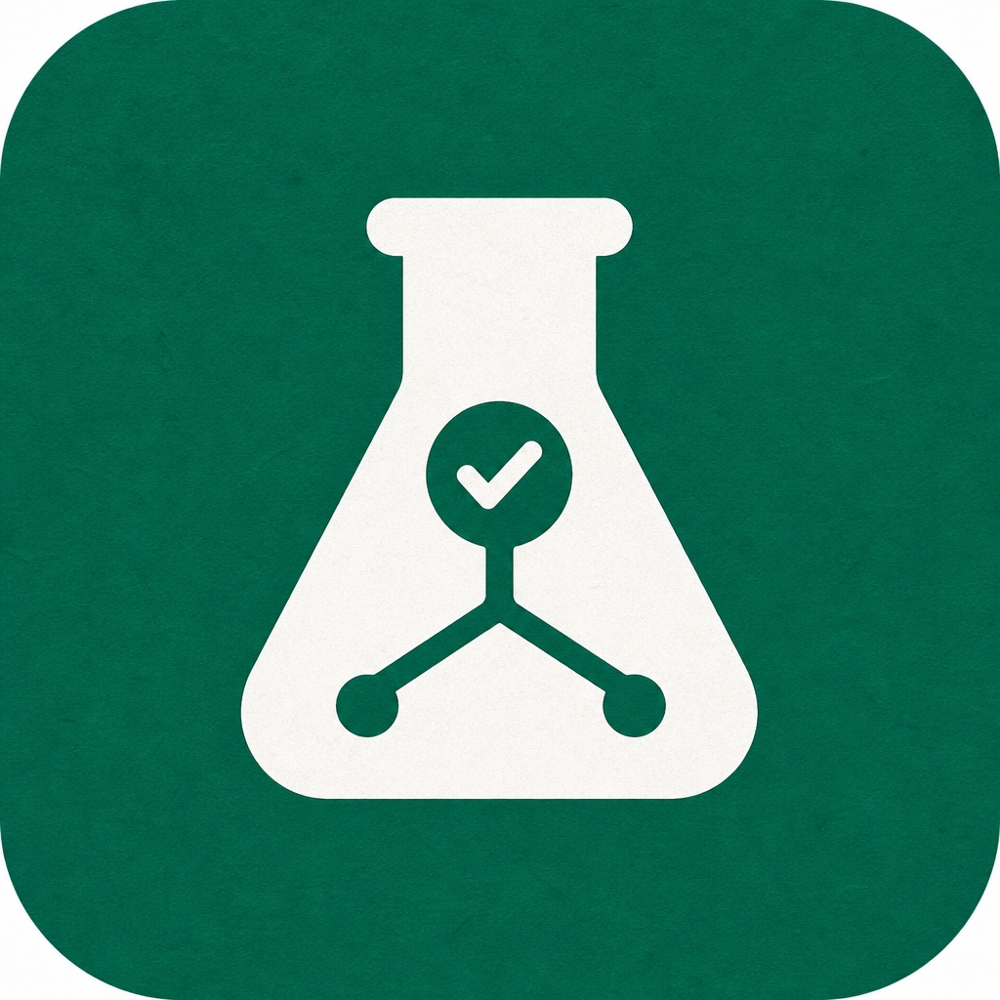
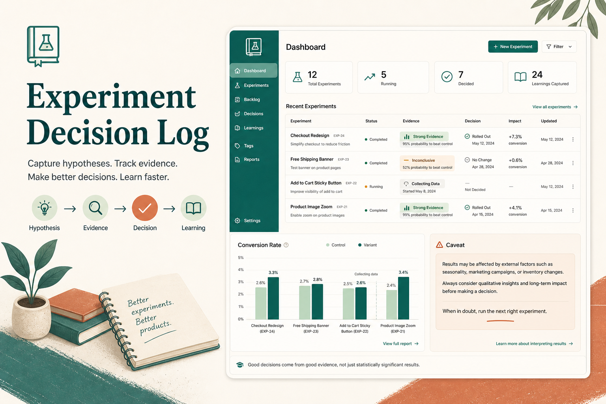
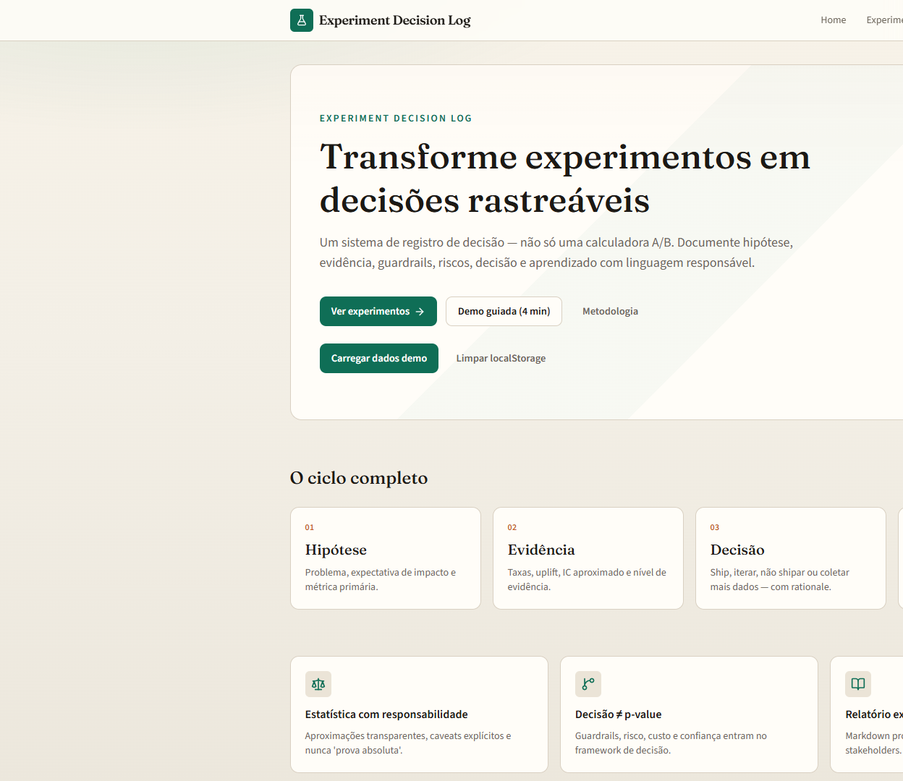
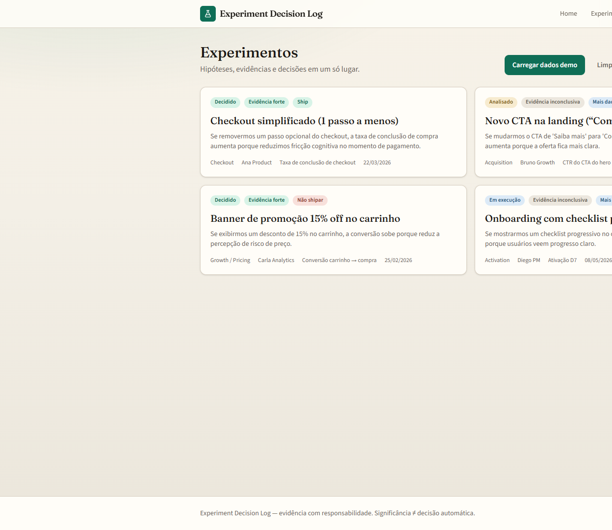
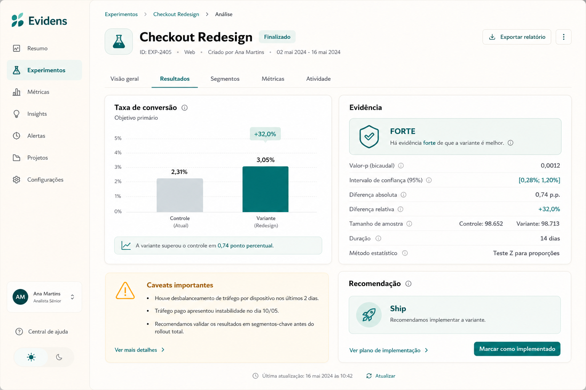
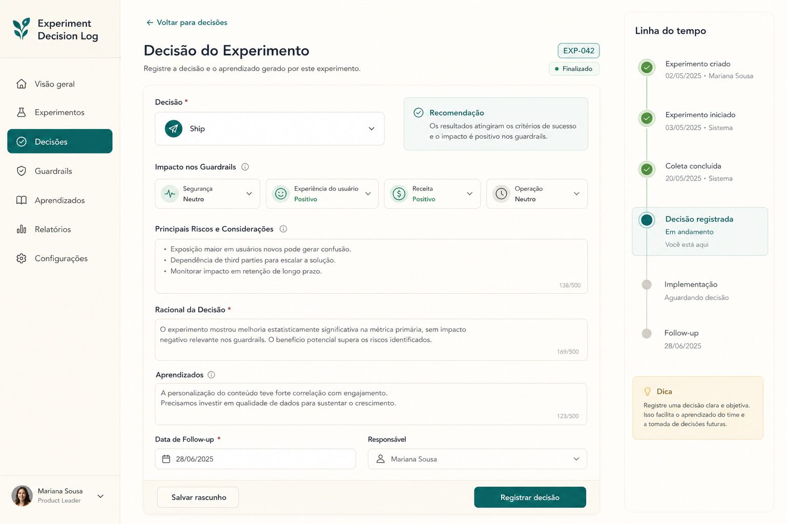
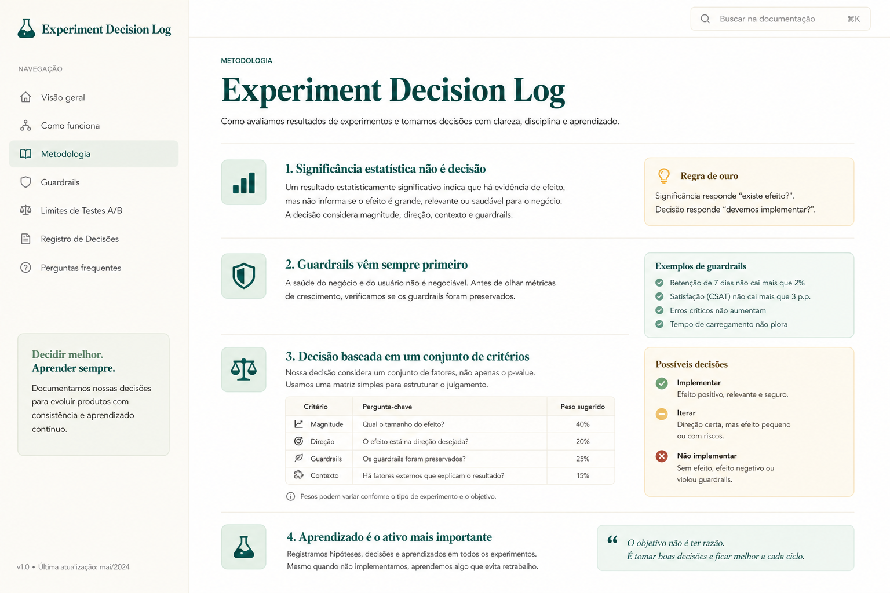

<div align="center">
  

  <h1>Experiment Decision Log</h1>

  <p><strong>Transforme experimentos em decisões rastreáveis: hipótese → evidência → decisão → aprendizado.</strong></p>
  <p><strong>Turn experiments into traceable decisions: hypothesis → evidence → decision → learning.</strong></p>

  <p>
    <a href="https://experiment-decision-log.vercel.app"><strong>Live Demo</strong></a> •
    <a href="#1-visão-geral--overview">PT-BR / English Overview</a> •
    <a href="#-product-preview">Preview</a> •
    <a href="#-screenshots">Screenshots</a> •
    <a href="#️-stack--tecnologias">Stack</a> •
    <a href="#-arquitetura--architecture">Architecture</a> •
    <a href="#-quick-start--início-rápido">Quick Start</a> •
    <a href="#-autor--author">Author</a>
  </p>

  <p>
    <a href="https://experiment-decision-log.vercel.app"></a>
    
    
    
    
    
    
  </p>
</div>

<p align="center">
  
</p>

---

## 1. Visão Geral / Overview

O **Experiment Decision Log** é um produto de product analytics criado para transformar testes A/B em **decisões documentadas e auditáveis**.

Ele cobre o ciclo completo de **hipótese, métricas, guardrails, resultados agregados, evidência estatística aproximada, recomendação, decisão humana, aprendizado e exportação de relatório**. Em vez de parar no cálculo, o sistema registra o que foi decidido, com qual evidência, quais riscos existiam e o que será acompanhado depois.

O projeto foi desenvolvido por **Felipe Alirio Baruja** como peça de portfólio, combinando estatística aplicada, product analytics, UX para times não técnicos e engenharia frontend moderna.

> **Responsible Analytics Notice**  
> O Experiment Decision Log foi criado para documentar evidência e decisão de produto. Ele **não prova** resultados de forma absoluta, **não substitui** revisão humana e **não deve** ser usado como motor automático de ship sem julgamento de negócio.

---

## ✨ Product Preview

<p align="center">
  
</p>

A experiência é clara e executiva: ciclo hipótese → evidência → decisão → aprendizado, badges de evidência, caveats explícitos, timeline de eventos e relatório Markdown exportável.

---

## 2. Por que este projeto importa? / Why this project matters

* **Cálculo sem decisão é frágil para portfólio:** Muitos projetos mostram p-value e param. Times reais precisam de rationale, guardrails e follow-up.
* **Significância ≠ decisão:** Um resultado “significativo” na métrica primária pode destruir ticket médio, UX ou margem. O framework força essa leitura.
* **Responsabilidade analítica:** Linguagem cautelosa, caveats obrigatórios e recomendação apenas como sugestão — nunca certeza absoluta.
* **Produto, não notebook:** Substitui scripts isolados por uma aplicação navegável, testável e apresentável em entrevista.

---

## 🧠 O diferencial / What makes it different

### Português
O Experiment Decision Log não é apenas uma calculadora A/B. Ele combina evidência estatística, framework de decisão e memória institucional em uma experiência rastreável.

Ele mostra não apenas se a variante “ganhou”, mas também:
- quão forte é a evidência;
- se a amostra é confiável;
- se guardrails foram prejudicados;
- quais riscos e custos existem;
- o que o time aprendeu;
- o que será monitorado no follow-up.

### English
Experiment Decision Log is not just an A/B calculator. It combines statistical evidence, a decision framework and institutional memory into one traceable experience.

It shows not only whether a variant “won”, but also:
- how strong the evidence is;
- whether the sample is reliable;
- whether guardrails were harmed;
- which risks and costs exist;
- what the team learned;
- what will be monitored in follow-up.

---

## 🎯 Problema que resolve / The problem it solves

Em fluxos reais de experimentação, times costumam enfrentar:
- hipóteses mal documentadas;
- métricas primárias sem guardrails;
- resultados sem interpretação responsável;
- decisões tomadas só por p-value;
- falta de timeline e aprendizado reutilizável;
- relatórios difíceis de apresentar a stakeholders;
- demos de estatística que não mostram maturidade de produto.

O **Experiment Decision Log** cria uma camada organizada entre o resultado do teste e a decisão de produto.

---

## 🧩 Proposta / Decision Pipeline

```txt
Hipótese + Contexto
  ↓
Métrica primária + Guardrails
  ↓
Variantes + Resultados agregados
  ↓
Análise de conversão (taxa, uplift, z/p, IC)
  ↓
Classificação de evidência + Caveats
  ↓
Sugestão de decisão (revisão humana)
  ↓
Decisão + Riscos + Aprendizado + Follow-up
  ↓
Timeline + Relatório Markdown
```

---

## 📸 Screenshots

<table>
  <tr>
    <td width="50%">
      
      <br />
      <sub><strong>Home</strong> — proposta de valor e ciclo hipótese → evidência → decisão → aprendizado.</sub>
    </td>
    <td width="50%">
      
      <br />
      <sub><strong>Experiments List</strong> — status, evidência, recomendação e owner em cards.</sub>
    </td>
  </tr>
  <tr>
    <td width="50%">
      
      <br />
      <sub><strong>Analysis Detail</strong> — taxas, uplift, IC, evidência e caveats responsáveis.</sub>
    </td>
    <td width="50%">
      
      <br />
      <sub><strong>Decision Panel</strong> — guardrails, risco, custo, aprendizado e follow-up.</sub>
    </td>
  </tr>
  <tr>
    <td width="50%">
      
      <br />
      <sub><strong>Methodology</strong> — limites de A/B, significância ≠ decisão e guardrails.</sub>
    </td>
    <td width="50%">
      
      <br />
      <sub><strong>Product Cover</strong> — visão geral do sistema de registro de decisão.</sub>
    </td>
  </tr>
</table>

---

## 📄 Relatório exportável / Exportable Report

O relatório Markdown consolida título, contexto, hipótese, período, owner, métrica primária, guardrails, resultados, interpretação, caveats, decisão, aprendizado, follow-up e data de exportação — pronto para handoff e entrevista.

---

## 📌 Estudo de Caso / Case Study

### 📌 Quatro demos, quatro decisões

1. **Checkout simplificado** — evidência forte, guardrail ok → **ship** com monitoramento.
2. **Novo CTA na landing** — diferença pequena → **inconclusivo / coletar mais dados**.
3. **Promoção 15% off** — conversão sobe, AOV cai → **do_not_ship**.
4. **Onboarding checklist** — ~70 visitantes/grupo → **amostra insuficiente**.

### 📌 Four demos, four decisions

1. **Simplified checkout** — strong evidence, healthy guardrail → **ship** with monitoring.
2. **New landing CTA** — small lift → **inconclusive / collect more data**.
3. **15% off promo** — conversion up, AOV down → **do_not_ship**.
4. **Onboarding checklist** — ~70 visitors/group → **underpowered sample**.

Essas narrativas mostram maturidade analítica: nem todo sinal positivo vira ship, e nem todo teste “terminado” está pronto para decisão.

---

## 🧭 Visual Story / Jornada do usuário

```txt
1. Abrir a home e entender o ciclo de decisão
2. Carregar dados demo (4 experimentos)
3. Explorar a lista com badges de evidência/status
4. Abrir o checkout (ship) e a promoção (trade-off)
5. Revisar análise, IC, caveats e recomendação
6. Registrar ou inspecionar a decisão humana
7. Percorrer a timeline do experimento
8. Exportar o relatório Markdown
9. Ler a página de metodologia e limitações
```

---

## ⚙️ Funcionalidades Principais / Core Features

### Experiment Registry
Cadastro de contexto, hipótese, owner, área de produto, período, riscos e status (`draft` → `decided`).

### Metrics & Guardrails
Métrica primária + guardrails com direção desejada (`increase`, `decrease`, `no_regression`).

### Conversion Analysis
Taxas, diferença absoluta, uplift relativo, z-score aproximado, p-value bilateral, IC ~95% da diferença e classificação de evidência.

### Decision Framework
Sugestões `ship` / `do_not_ship` / `iterate` / `collect_more_data`, com campos obrigatórios de rationale, guardrails, riscos, aprendizado e follow-up.

### Timeline & Markdown Export
Eventos rastreáveis (`created`, `analyzed`, `decision_recorded`…) e relatório exportável para portfólio/stakeholders.

### Demo Loader + localStorage
Quatro experimentos demo e persistência local no MVP, sem backend obrigatório.

---

## 🛠️ Stack / Tecnologias

### Frontend
- **Framework:** Next.js 15 (App Router) & React 19
- **Linguagem:** TypeScript
- **Estilização:** Tailwind CSS v4
- **Validação:** Zod
- **Gráficos:** Recharts
- **Ícones:** Lucide React
- **Persistência MVP:** localStorage

### Qualidade
- **Testes:** Vitest (estatística, regras de decisão, export e demos)
- **Lint:** ESLint + eslint-config-next

---

## 🧱 Arquitetura / Architecture

```text
experiment-decision-log/
├── src/
│   ├── app/                      # Rotas App Router
│   │   ├── page.tsx              # Home
│   │   ├── experiments/          # Lista, novo, detalhe, edição
│   │   └── methodology/          # Metodologia do produto
│   ├── components/
│   │   ├── experiments/          # Cards, form, badges, demo loader
│   │   ├── decisions/            # Decision panel, timeline, export
│   │   ├── metrics/              # Analysis summary + chart
│   │   └── layout/               # Header / footer
│   ├── lib/
│   │   ├── experiment-model.ts   # Modelo Zod + helpers
│   │   ├── statistics.ts         # Conversão, uplift, z/p, IC
│   │   ├── decision-rules.ts     # Evidência + recomendações
│   │   ├── demo-data.ts          # 4 experimentos demo
│   │   ├── markdown-export.ts    # Relatório Markdown
│   │   ├── storage.ts            # Persistência local
│   │   └── experiments-context.tsx
│   └── tests/                    # Vitest
├── docs/                         # Notas estatísticas e framework
├── assets/                       # Ícone, hero, screenshots, social
├── HANDOFF_PORTFOLIO.md
├── LICENSE
└── README.md
```

---

## 🔁 Analytical Flow

```txt
Aggregated Results (control / variant)
  ↓
Conversion rates + absolute difference + relative uplift
  ↓
Approximate two-proportion z-test + 95% CI
  ↓
Evidence level (inconclusive → strong)
  ↓
Recommendation suggestion (human review required)
  ↓
Decision record + learning + follow-up
  ↓
Timeline + Markdown report
```

---

## 🚀 Quick Start / Início Rápido

### Live Demo
**Produção:** [https://experiment-decision-log.vercel.app](https://experiment-decision-log.vercel.app)

- **Demo guiada (≈4 min):** [/tour](https://experiment-decision-log.vercel.app/tour)
- **Case sintético completo:** [/cases/promo-aov](https://experiment-decision-log.vercel.app/cases/promo-aov)

Na primeira visita, os **4 experimentos demo** são carregados automaticamente no `localStorage`. Use **Carregar dados demo** para resetar.


### Pré-requisitos (local)
- **Node.js** v20 ou superior
- **npm**
- **Git**

### Execução local

```bash
git clone https://github.com/BarujaFe1/experiment-decision-log.git
cd experiment-decision-log
npm install
npm run dev
```

Abra [http://localhost:3000](http://localhost:3000).

Na primeira visita, os 4 experimentos demo são carregados automaticamente. Use **Carregar dados demo** se limpar o `localStorage`.

---

## 🧪 Scripts e Testes / Scripts and Testing

```bash
npm test          # Vitest — regras estatísticas e de decisão
npm run typecheck # TypeScript estrito (tsc --noEmit)
npm run lint      # ESLint
npm run build     # Build de produção Next.js
npm run dev       # Servidor de desenvolvimento
```

Cobertura principal dos testes:
1. taxa de conversão  
2. diferença absoluta  
3. uplift relativo  
4. divisão por zero (controle = 0)  
5. amostra insuficiente  
6. evidência forte / inconclusiva  
7. taxas extremas (0% vs 100%) sem IC falso  
8. recomendação com guardrail prejudicado  
9. matriz ship / iterate / high-risk / lift negativo  
10. exportação Markdown + consistência dos demos  

CI: `.github/workflows/ci.yml` (lint → typecheck → test → build).

---

## 🔐 Variáveis de ambiente

O MVP **não exige secrets**. Use `.env.example` como referência.

```bash
cp .env.example .env.local   # opcional
```

Persistência é 100% `localStorage` no browser.

---

## 🧭 Decisões técnicas e trade-offs

| Decisão | Trade-off |
| --- | --- |
| Frontend-only + localStorage | Demo instantânea; sem sync multi-device |
| Z-test / IC aproximados | Transparentes e testáveis; não cobrem peeking/múltiplos testes |
| Guardrail qualitativo | Honestidade de escopo; AOV contínuo fica no roadmap |
| Sugestão ≠ decisão | Força rationale humano; usuário pode discordar (intencional) |
| Sem auth | Portfólio simples; não é ferramenta multi-usuário |

Detalhes: [`docs/TECHNICAL_DECISIONS.md`](docs/TECHNICAL_DECISIONS.md) · [`docs/ARCHITECTURE.md`](docs/ARCHITECTURE.md)

---

## 📊 Metodologia Estatística / Statistical Methodology

Para métrica binária/conversão:

* **Taxa:** `conversões / visitantes`
* **Diferença absoluta:** `p_variant − p_control`
* **Uplift relativo:** `Δ / p_control` (indefinido se controle = 0)
* **Z-test aproximado** de duas proporções (variância pooled)
* **p-value bilateral** via CDF normal aproximada
* **IC ~95%** da diferença (SE não pooled)
* **Regra de amostra:** &lt;100 visitantes/grupo → baixa confiabilidade

### Heurística de evidência
- amostra insuficiente → `inconclusive`
- p &lt; 0.05 e IC não cruza zero → `strong`
- 0.05 ≤ p &lt; 0.10 → `moderate` / `weak`
- IC cruza zero com p alto → `inconclusive`

Detalhes: [`docs/statistical-notes.md`](docs/statistical-notes.md) · [`docs/decision-framework.md`](docs/decision-framework.md)

---

## 🛡️ Responsabilidade Analítica / Responsible Analytics

* Nunca afirma que o experimento “prova” algo de forma absoluta
* Caveats sempre visíveis na análise
* Recomendação automática é **sugestão**, não decisão final
* Guardrail prejudicado prioriza proteção do negócio
* Decisão exige rationale, riscos, aprendizado e follow-up
* Limitações documentadas na página de metodologia e no README

---

## 🧭 Roadmap do Produto

* **MVP atual:** frontend-first, localStorage, análise de proporções, demos, export Markdown, testes
* **Próximo:** persistência SQLite/API
* **Próximo:** métricas contínuas (AOV / RPV) com testes adequados
* **Próximo:** import CSV de resultados agregados
* **Próximo:** power analysis simples e templates de pré-teste
* **Futuro:** autenticação leve para times pequenos

---

## 🧭 Status atual

- **Papel no portfólio:** selecionado (par do StatLab; não precisa ser o único “hero”)
- **Deploy:** Vercel production em `main`
- **Escopo:** lab/MVP frontend-first — localStorage, estatística aproximada, guardrails qualitativos
- **Não é:** plataforma de experimentação, feature flagger, nem motor de ship automático

Par com StatLab (cálculo ≠ decisão): [`docs/STATLAB_PAIRING.md`](docs/STATLAB_PAIRING.md)

---

## 💼 Valor para Portfólio / Portfolio Value

O projeto demonstra competências para **Product Analytics, Growth Analytics, Analytics Engineering e Product Management técnico**:
- estatística aplicada com linguagem responsável
- framework de decisão além do p-value
- modelagem de dados e regras testáveis
- UX clara para stakeholders não técnicos
- documentação e storytelling de portfólio

### O que este projeto demonstra

- Separar **evidência estatística** de **decisão de produto**
- Projetar demos que contam trade-offs reais (ex.: conversão sobe / AOV cai)
- Escrever domínio puro testável (`statistics` / `decision-rules`) fora da UI
- Comunicar limitações sem enfraquecer o produto

### Como eu apresentaria em entrevista

1. Abrir a live demo e contrastar checkout (ship) vs promoção (do_not_ship).
2. Mostrar caveats e dizer o que o p-value **não** autoriza.
3. Registrar uma decisão com rationale/follow-up e exportar Markdown.
4. Abrir um teste Vitest da matriz de recomendação.
5. Citar trade-offs: localStorage, aproximações, guardrails qualitativos.

Guia completo: [`HANDOFF_PORTFOLIO.md`](HANDOFF_PORTFOLIO.md)

---

## 📚 Documentação Complementar

- [`docs/PORTFOLIO_HANDOFF.md`](docs/PORTFOLIO_HANDOFF.md)
- [`docs/STATLAB_PAIRING.md`](docs/STATLAB_PAIRING.md)
- [`docs/SCREENSHOTS.md`](docs/SCREENSHOTS.md)
- [`docs/ARCHITECTURE.md`](docs/ARCHITECTURE.md)
- [`docs/TECHNICAL_DECISIONS.md`](docs/TECHNICAL_DECISIONS.md)
- [`docs/TESTING.md`](docs/TESTING.md)
- [`docs/DEPLOYMENT.md`](docs/DEPLOYMENT.md)
- [`docs/AUDIT_REPORT.md`](docs/AUDIT_REPORT.md)
- [`docs/HANDOFF.md`](docs/HANDOFF.md)
- [`docs/statistical-notes.md`](docs/statistical-notes.md)
- [`docs/decision-framework.md`](docs/decision-framework.md)
- [`docs/demo-story.md`](docs/demo-story.md)
- [`HANDOFF_PORTFOLIO.md`](HANDOFF_PORTFOLIO.md)

---

## 🖼️ GitHub Social Preview

Imagem disponível em:
```txt
assets/social-preview.png
```
Dimensão recomendada: 1280×640, &lt;1MB. Upload em: **Repository Settings → Social Preview**.

---

## 🔖 GitHub Repository Metadata

### About sugerido
```txt
Decision log for product experiments: hypothesis → evidence → decision → learning. Responsible A/B analysis with guardrails and exportable reports.
```

### Topics sugeridos
```txt
product-analytics
experimentation
ab-testing
statistics
decision-framework
nextjs
typescript
vitest
recharts
portfolio-project
responsible-analytics
growth
localstorage
markdown
```

---

## 👤 Autor / Author

Desenvolvido por **Felipe Alirio Baruja**.

- **Portfolio:** [barujafe.vercel.app](https://barujafe.vercel.app/)
- **GitHub:** [@BarujaFe1](https://github.com/BarujaFe1)
- **LinkedIn:** [Gustavo Felipe Alirio Baruja](https://www.linkedin.com/in/barujafe/)

---

## 📄 Licença / License

MIT License. Copyright (c) 2026 Felipe Alirio Baruja.

O código está disponível sob a licença MIT — ver arquivo [`LICENSE`](LICENSE).
