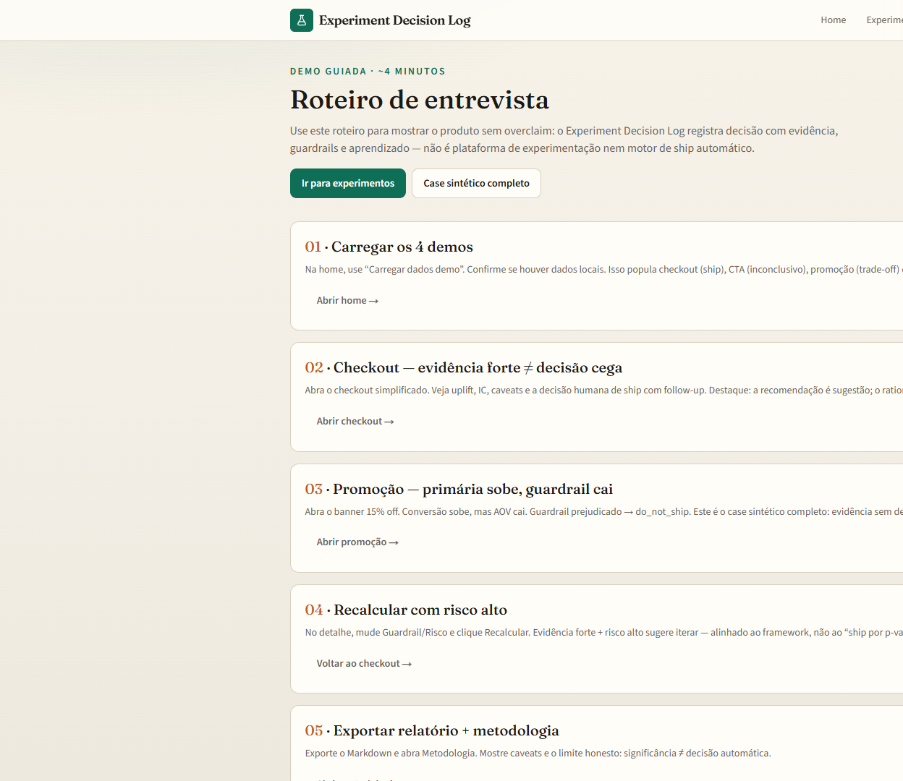
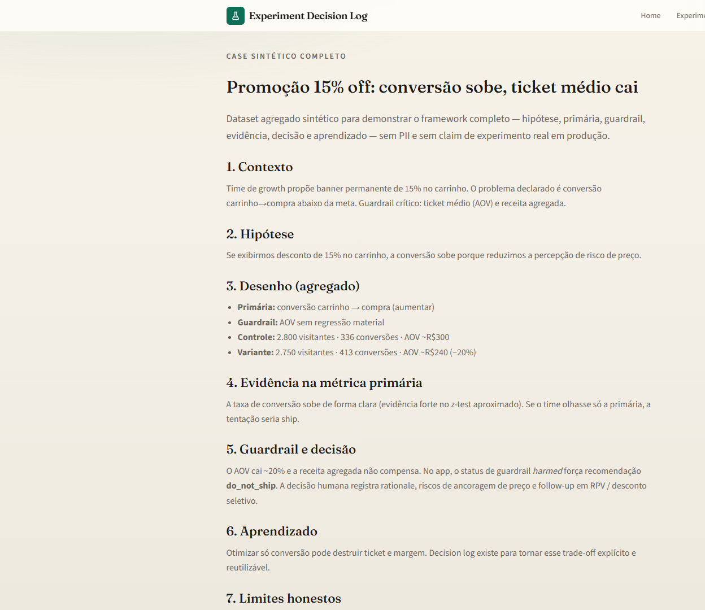

<div align="center">
  

  <h1>Experiment Decision Log</h1>

  <p><strong>Registro de decisão para experimentos: hipótese → evidência → decisão → aprendizado.</strong></p>
  <p><strong>Decision log for product experiments: hypothesis → evidence → decision → learning.</strong></p>

  <p>
    <a href="#pt-br">PT-BR</a> ·
    <a href="#english">English</a> ·
    <a href="#live-demo">Live Demo</a> ·
    <a href="#stack">Stack</a> ·
    <a href="#architecture">Architecture</a> ·
    <a href="#quick-start">Quick Start</a> ·
    <a href="#author">Author</a>
  </p>

  <p>
    
    
    
    
    
    
  </p>

  <p>
    <a href="https://experiment-decision-log.vercel.app"><strong>Live Demo</strong></a> ·
    <a href="https://github.com/BarujaFe1/experiment-decision-log"><strong>Repo</strong></a> ·
    <a href="https://barujafe.vercel.app/"><strong>Portfolio</strong></a> ·
    <a href="https://www.linkedin.com/in/barujafe/"><strong>LinkedIn</strong></a>
  </p>
</div>

<p align="center">
  
</p>

> **Lab / demo notice:** frontend-first A/B decision lab with **localStorage**. Approximate proportion tests with caveats — **not** a production experiment platform, feature flagger or formal statistical design tool.

---

## PT-BR

### Visão geral
O **Experiment Decision Log** transforma testes A/B em decisões documentadas: hipótese, métricas, guardrails, evidência (com caveats), decisão humana, timeline e relatório Markdown.

### Problema
Muitos projetos param no p-value. Significância estatística não é decisão — falta registrar risco, guardrails, custo e aprendizado.

### Para quem
Product analysts, growth/PMs e data scientists que precisam fechar o ciclo de experimento com responsabilidade.

### Funcionalidades
- Cadastro de hipótese, variantes, métrica primária e guardrails
- Análise de proporções (uplift, IC aproximado, nível de evidência) com linguagem cautelosa
- Framework de decisão (rationale, impacto em guardrails, riscos, follow-up)
- Timeline e export Markdown
- 4 demos: ship forte, inconclusivo, trade-off conversão vs AOV, amostra insuficiente
- Tour guiado e case sintético
- Testes Vitest das regras estatísticas e de decisão

### Escopo e limites (honestos)
- Sem backend multi-usuário, sem tracking/split real
- Estatística simplificada para proporções (não substitui design formal de alto risco)
- Guardrails ainda qualitativos no MVP
- Persistência em `localStorage`

---

## English

### Overview
**Experiment Decision Log** turns A/B tests into documented decisions: hypothesis, metrics, guardrails, evidence (with caveats), human decision, timeline and Markdown report.

### Problem
Many projects stop at the p-value. Statistical significance is not a decision — risk, guardrails, cost and learning still need a record.

### Who it is for
Product analysts, growth/PMs and data scientists who need a responsible experiment close-out loop.

### Features
- Hypothesis, variants, primary metric and guardrails
- Proportion analysis (uplift, approximate CI, evidence level) with cautious language
- Decision framework (rationale, guardrail impact, risks, follow-up)
- Timeline and Markdown export
- Four demos: strong ship, inconclusive, conversion vs AOV trade-off, underpowered sample
- Guided tour and synthetic case
- Vitest coverage for statistics and decision rules

### Scope and honest limits
- No multi-user backend, no real tracking/split
- Simplified proportion statistics (not a substitute for high-stakes formal design)
- Guardrails are still qualitative in the MVP
- Persistence is `localStorage`

---

## Live Demo

| Surface | URL |
|---|---|
| **Public lab** | [https://experiment-decision-log.vercel.app](https://experiment-decision-log.vercel.app) |
| **Guided tour** | [/tour](https://experiment-decision-log.vercel.app/tour) |
| **Promo case** | [/cases/promo-aov](https://experiment-decision-log.vercel.app/cases/promo-aov) |
| **GitHub** | [https://github.com/BarujaFe1/experiment-decision-log](https://github.com/BarujaFe1/experiment-decision-log) |

**How to try:** open the lab → load demos → open analysis (note caveats) → fill the decision panel → export Markdown. Use **Carregar dados demo** to reset localStorage.

---

## Screenshots

<table>
  <tr>
    <td width="50%"><br /><sub><strong>Home</strong></sub></td>
    <td width="50%"><br /><sub><strong>Experiments</strong></sub></td>
  </tr>
  <tr>
    <td width="50%"><br /><sub><strong>Analysis</strong></sub></td>
    <td width="50%"><br /><sub><strong>Decision panel</strong></sub></td>
  </tr>
  <tr>
    <td width="50%"><br /><sub><strong>Methodology</strong></sub></td>
    <td width="50%"><br /><sub><strong>Tour</strong></sub></td>
  </tr>
</table>

<p align="center"><br /><sub><strong>Promo / AOV case</strong></sub></p>

---

## Stack

| Layer | Technology |
|---|---|
| App | Next.js 15, React 19, TypeScript, Tailwind CSS 4 |
| Domain | Zod, custom statistics + decision rules, localStorage |
| Charts / tests | Recharts, Lucide, Vitest, Testing Library |

---

## Architecture

```txt
src/
  app/            pages (home, experiments, cases, tour, methodology)
  components/     decisions, experiments, metrics, layout
  lib/            experiment-model, statistics, decision-rules, storage, markdown-export
  tests/          Vitest
assets/           icon, hero, screenshots
```

Flow: hypothesis → results → evidence classification → human decision → timeline → Markdown report.

---

## Quick Start

**Prerequisites:** Node.js 20+, npm, Git.

```bash
git clone https://github.com/BarujaFe1/experiment-decision-log.git
cd experiment-decision-log
npm install
npm run dev
```

Open [http://localhost:3000](http://localhost:3000).

```bash
npm test
npm run typecheck
```

---

## Technical decisions

- **Decision over calculator:** auto recommendation is a suggestion; UI requires human rationale
- **Cautious statistics language** with caveats for underpowered / zero-division cases
- **Demo narratives** that include trade-offs and inconclusive outcomes (not only “wins”)
- **Frontend-first** storage ready to evolve to API/SQLite later

---

## Roadmap

- Backend SQLite / FastAPI
- Continuous metrics and revenue-per-visitor
- CSV import + pre-test templates
- Simple power analysis
- Light auth for teams

---

## Author

**Felipe Alirio Baruja** — data / product / full-stack portfolio.

- Portfolio: [https://barujafe.vercel.app/](https://barujafe.vercel.app/)
- GitHub: [https://github.com/BarujaFe1](https://github.com/BarujaFe1)
- LinkedIn: [https://www.linkedin.com/in/barujafe/](https://www.linkedin.com/in/barujafe/)

---

## License

MIT — see [`LICENSE`](./LICENSE).
